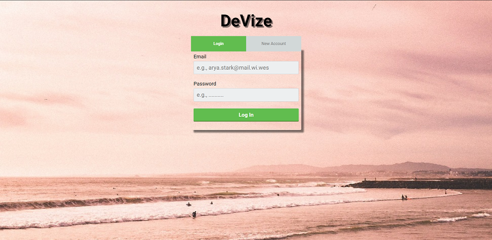
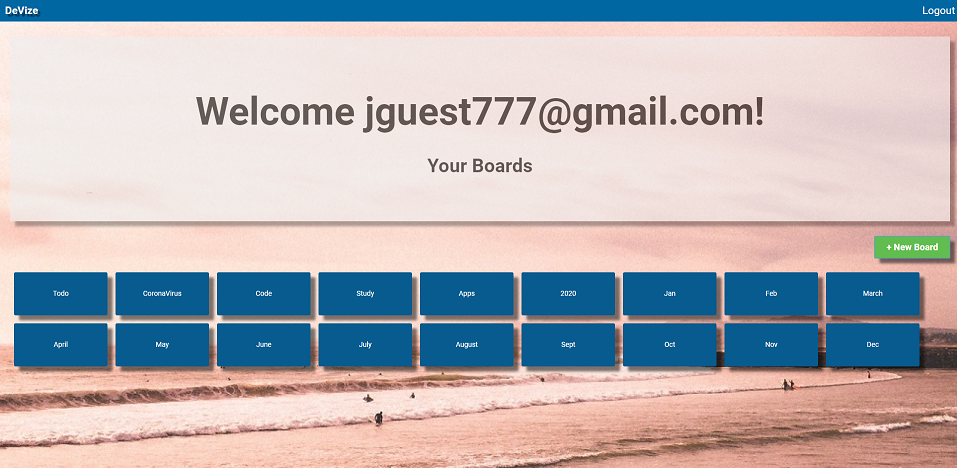
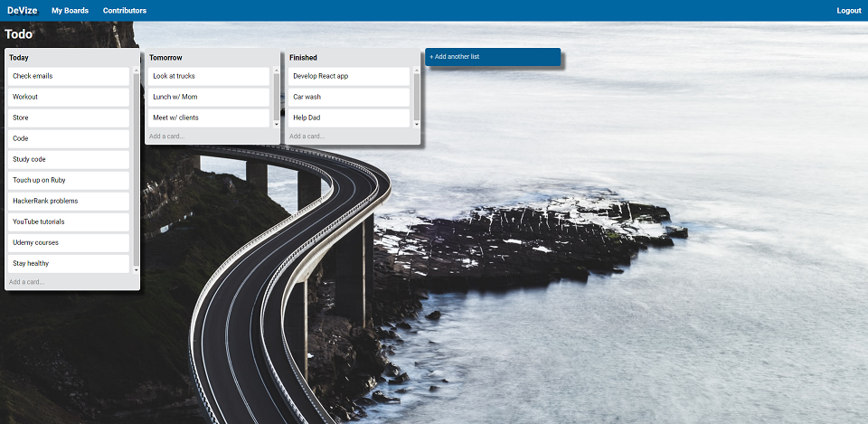
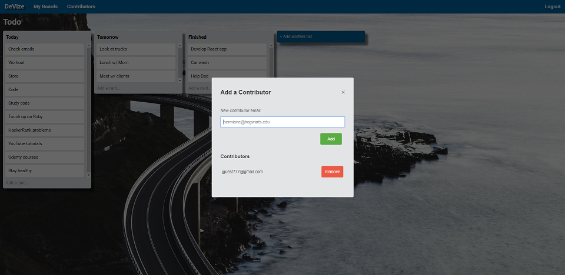
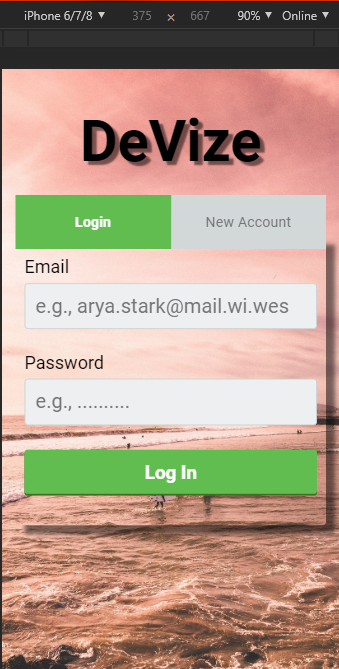
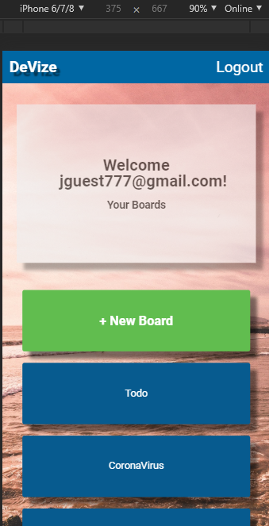
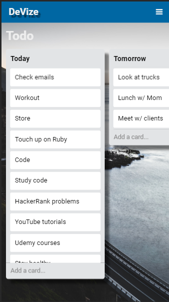
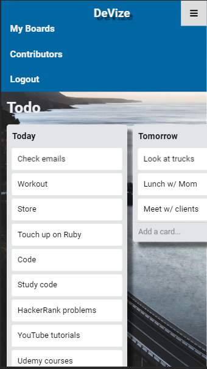

# DeVize

A Full Stack mobile-friendly Trello clone built using only vanilla JavaScript, Ruby on Rails, HTML5 and CSS3.

## Be in charge of your Organization

## Drag n' Drop Functionality

## Add Contributors

## Mobile-friendly

## Deployment

- [https://devize.herokuapp.com/](https://devize.herokuapp.com/)

## Tech

- [JavaScript](https://developer.mozilla.org/en-US/docs/Web/JavaScript) v: ES6
- [Ruby](https://www.ruby-lang.org/en/documentation/) v: 2.5.3
- [Rails](https://rubyonrails.org/) - v: 5.2.2
- [postgreSQL](https://www.postgresql.org/) - Database
- [Heroku](https://devcenter.heroku.com/) - Deployment
